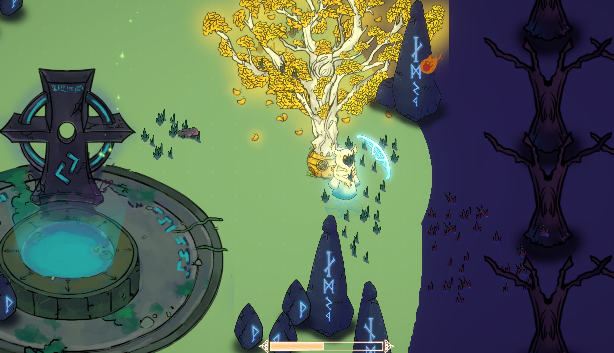
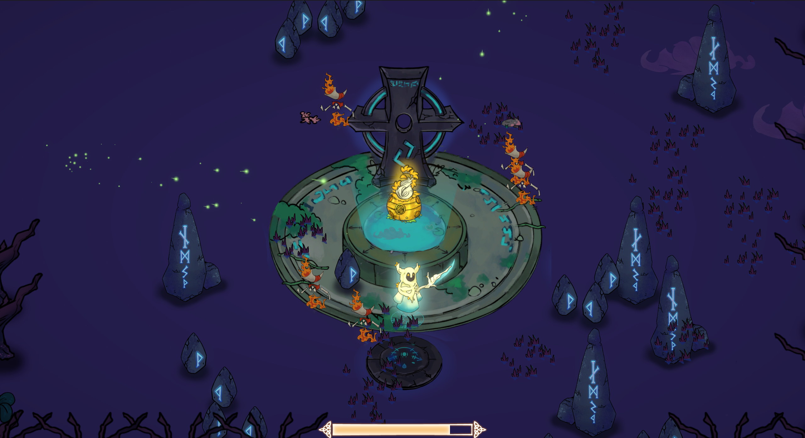

## Pitch

Three Norns need to lead and protect the last tree in the world. For that purpose, they are linked to it, and the tree shares its strength with them.
- Use your abilities to defend the tree and help its survival.
- Cooperate to drag it towards spaces suited for its growth.
- Fight against agents of chaos to save the world from its demise.

## Gameplay

The game is separated in two different phases:

1. The players are linked to the tree and lead it to points where it can grow, while protecting it against fireballs using their shields.

2. The tree is growing and the players aren't linked to the tree. Waves of enemies try to reach the tree to attack it and the players must kill them using their swords.

After both phases are completed, the tree grows a bit, and the players must find another suitable place for the tree to continue growing.

Once the tree has grown 4 times, the central fountain opens and the tree can grow one last time to end the game.

## Credits

Designers:
- HUBERT Basile
- LUBER Pascal-Matthieu

Programmer:
- SERRA Rémi

2D Artists:
- LEBTAHI Nedjma 
- MAHMOUD Sarah 
- SENE Côme 
- FENG Julia

Sound designer:
- RUDZKY-CLEROT Loni

This game was created for the GameWeek, a one week game jam hosted by the **ISART Digital Paris** video game school.